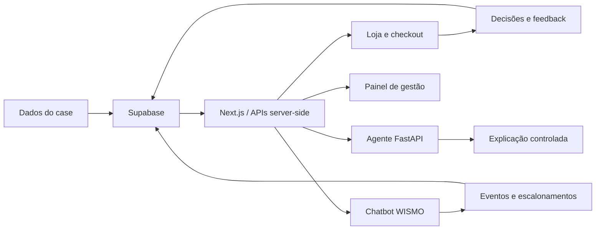

# MIPO — Motor Inteligente de Priorização Operacional

Aplicação full stack criada para o case Vértice/EloGroup. O MIPO transforma sinais de vendas, estoque, devoluções, atendimento e logística em intervenções acionáveis antes e depois da compra, com decisões determinísticas, explicações assistidas por IA e rastreabilidade operacional.

## Contexto do projeto

A análise do case identificou duas fontes relevantes de perda de margem e atrito na jornada:

- devoluções evitáveis, especialmente por tamanho incorreto, expectativa e defeito;
- contatos WISMO (*Where Is My Order?*), que representam dúvidas recorrentes sobre status e prazo de entrega.

O experimento de previsão de devolução obteve ROC-AUC de 0,497. Por isso, o MVP não delega decisões críticas a um modelo preditivo: regras auditáveis calculam risco, recomendação e elegibilidade, enquanto a IA generativa apenas explica resultados autorizados.

## Solução

O produto cobre quatro frentes integradas:

1. **Loja e checkout assistido:** catálogo, carrinho e avaliação de risco por produto/variante, com recomendação de tamanho ou alternativa antes da compra.
2. **Pós-compra WISMO:** em `/pedido`, o cliente pode consultar um pedido com código ou conversar sem código para tirar dúvidas gerais. O motor consolida status, prazo, último evento e necessidade de escalonamento.
3. **Painel de gestão:** em `/painel`, indicadores agregados apoiam o acompanhamento de margem, estoque, intervenções, aceite, devoluções, WISMO e cenários de impacto.
4. **Agente governado:** um runtime FastAPI/LangGraph usa ferramentas com contrato restrito para explicar evidências. Ele não altera risco, estoque, variante ou ações definidas pelo motor determinístico.



## O que está implementado

- catálogo e carrinho em modo local ou Supabase;
- checkout demonstrativo idempotente, sem cobrança financeira;
- motor determinístico de risco e recomendação de tamanho;
- feedback sobre ajuste e registro de decisões do cliente;
- concierge e auditoria de sacola como recursos experimentais;
- consulta WISMO por código de pedido com SLA por canal e localização;
- chatbot de dúvidas gerais pós-compra sem exigir código;
- registro de avaliações, notas e eventos WISMO no Supabase;
- painel gerencial com indicadores e simuladores explicitamente rotulados;
- agente Python com autenticação, timeout, cache, auditoria e fallback determinístico;
- importadores com *dry-run*, hash dos arquivos, quarentena e proteção contra repetição;
- RLS nas tabelas e acesso ao banco somente por rotas server-side.

## Tecnologias

- **Web:** Next.js 16, React 19 e TypeScript;
- **Visualização:** Recharts;
- **Banco e persistência:** Supabase/PostgreSQL;
- **Agente:** Python 3.12, FastAPI, LangGraph e Pydantic;
- **IA:** EloAgents como provedor primário e Groq como fallback opcional;
- **Qualidade:** Vitest, Pytest, TypeScript e suíte de avaliação offline do agente;
- **Deploy:** Vercel em dois projetos, um para a aplicação web e outro para o agente.

## Estrutura de pastas

```text
.
├── analises/               # notebooks da exploração e validação metodológica
├── data/                   # contrato dos dados; bases brutas não são versionadas
├── docs/                   # arquitetura, evidências, MVP, roadmap, deploy e demo
├── entregáveis/            # materiais finais do case e planilhas
├── notebooks/              # análises auxiliares
├── public/                 # imagens e demais arquivos estáticos
├── scripts/                # importação, seed, reset e assistentes de configuração
├── services/agent/         # agente FastAPI/LangGraph e sua suíte de avaliação
├── src/
│   ├── app/                # páginas e APIs do Next.js
│   ├── components/         # componentes da interface
│   ├── data/               # fixtures públicas para desenvolvimento local
│   ├── domain/             # regras determinísticas e contratos de domínio
│   ├── lib/                # utilitários e infraestrutura compartilhada
│   ├── server/             # serviços exclusivamente server-side
│   └── services/           # adaptadores de comércio, MIPO e WISMO
├── supabase/migrations/    # esquema, RLS, funções e evoluções incrementais
└── tests/                  # testes de unidade e integração da aplicação web
```

## Como rodar localmente

### Pré-requisitos

- Node.js 20;
- Corepack e pnpm;
- Python 3.12 e `uv` apenas para executar o agente;
- projeto Supabase apenas para o modo persistido.

### Aplicação web com dados locais

```bash
git clone https://github.com/Bootcamp-EloGroup/mipo.git
cd mipo
corepack enable
corepack pnpm install
cp .env.example .env.local
corepack pnpm dev
```

No `.env.local`, mantenha:

```dotenv
DATA_SOURCE=local
NEXT_PUBLIC_DATA_SOURCE=local
AI_EXPLANATIONS_ENABLED=false
```

Acesse:

- `http://localhost:3000/` — loja e checkout assistido;
- `http://localhost:3000/pedido` — chatbot pós-compra/WISMO;
- `http://localhost:3000/painel` — painel gerencial;
- `http://localhost:3000/api/health` — verificação de saúde da aplicação.

### Aplicação com Supabase

Configure as variáveis abaixo em `.env.local`:

```dotenv
DATA_SOURCE=supabase
NEXT_PUBLIC_DATA_SOURCE=supabase
SUPABASE_URL=https://SEU_PROJECT_REF.supabase.co
SUPABASE_SECRET_KEY=SEU_SECRET_SERVER_SIDE
```

Em seguida, vincule o projeto, revise as migrations e só então aplique-as:

```bash
npx supabase login
npx supabase link --project-ref SEU_PROJECT_REF
npx supabase db push --dry-run
npx supabase db push
```

O assistente `./scripts/setup-supabase.sh` também conduz essa configuração. Nunca use o prefixo `NEXT_PUBLIC_` em uma chave secreta.

Para usar o WISMO real, não defina `NEXT_PUBLIC_WISMO_SOURCE=mock`. O valor `mock` deve ser reservado a demonstrações explicitamente controladas.

### Agente de explicações

Em outro terminal:

```bash
cd services/agent
uv sync --dev
uv run uvicorn mipo_agent.main:app --reload
```

Na aplicação web, configure:

```dotenv
AI_EXPLANATIONS_ENABLED=true
MIPO_PYTHON_AGENT_URL=http://127.0.0.1:8000
MIPO_PYTHON_AGENT_TOKEN=UM_TOKEN_COMPARTILHADO
```

Configure o mesmo token no processo do agente. As chaves `ELOAGENTS_API_KEY` e `GROQ_API_KEY` são opcionais e devem existir somente no servidor. Sem um provedor disponível, a experiência preserva a resposta determinística.

## Importação dos dados do case

As bases brutas não são publicadas porque contêm identificadores e registros em granularidade de cliente, pedido e atendimento. Obtenha os arquivos pela fonte autorizada e mantenha-os fora do Git.

Os importadores executam *dry-run* por padrão:

```bash
corepack pnpm data:import -- \
  --sales /caminho/vendas.csv \
  --inventory /caminho/estoque.csv

corepack pnpm data:import-logistics -- \
  --sales /caminho/vendas.csv \
  --customers /caminho/clientes.csv
```

Revise o resumo e use `--apply` somente quando quiser persistir no Supabase. Outros importadores disponíveis estão documentados em [`data/README.md`](data/README.md).

## Testes e validação

Na raiz do projeto:

```bash
corepack pnpm lint
corepack pnpm test
corepack pnpm build
```

Para validar o agente sem rede ou credenciais:

```bash
cd services/agent
uv sync --dev
uv run pytest
uv run mipo-eval run --adapter offline
```

O *smoke test* com provedores externos exige consentimento explícito e pode consumir cota. Consulte [`services/agent/README.md`](services/agent/README.md).

## Deploy

O deploy completo usa dois projetos Vercel conectados à branch `main`:

1. **`mipo-agent`:** FastAPI com Root Directory `services/agent`;
2. **`mipo-web`:** Next.js com Root Directory `.`.

Publique primeiro o agente, valide `/health` e `/ready`, e depois configure sua URL e o token compartilhado no projeto web. O passo a passo, as variáveis por ambiente, os *smoke tests* e o rollback estão em [`docs/deploy-vercel.md`](docs/deploy-vercel.md). Também é possível iniciar o fluxo guiado com:

```bash
./scripts/setup-vercel.sh
```

## Limites e governança

- O checkout não processa pagamentos reais.
- O MIPO não integra ERP, WMS, TMS ou transportadoras em tempo real.
- Métricas financeiras históricas e cenários estimados não representam economia capturada.
- Associação estatística não prova causalidade.
- A IA explica evidências permitidas; regras determinísticas continuam responsáveis pelas decisões.
- Dados brutos, prompts, credenciais, PII e raciocínio interno não devem ser versionados.
- O painel expõe apenas dados agregados e identificadores adequadamente reduzidos.

## Documentação

- [`docs/evidencias.md`](docs/evidencias.md) — evidências e limites analíticos;
- [`docs/mvp.md`](docs/mvp.md) — definição funcional do MVP;
- [`docs/pos-venda-wismo.md`](docs/pos-venda-wismo.md) — regras e contrato do pós-venda;
- [`docs/arquitetura-agente-react.md`](docs/arquitetura-agente-react.md) — arquitetura e governança do agente;
- [`docs/roteiro-demonstracao.md`](docs/roteiro-demonstracao.md) — roteiro da demonstração;
- [`docs/roadmap.md`](docs/roadmap.md) — evolução técnica planejada;
- [`entregáveis/`](entregáveis/) — materiais finais do case.

## Integrantes

- [Christian Santos](https://www.linkedin.com/in/christian-gandra/)
- [Juliana Mota](https://www.linkedin.com/in/juliana-mota-11456b238/)
- [Yasmim Mattos](https://www.linkedin.com/in/yasmim-zeferino-37ba33355/)
