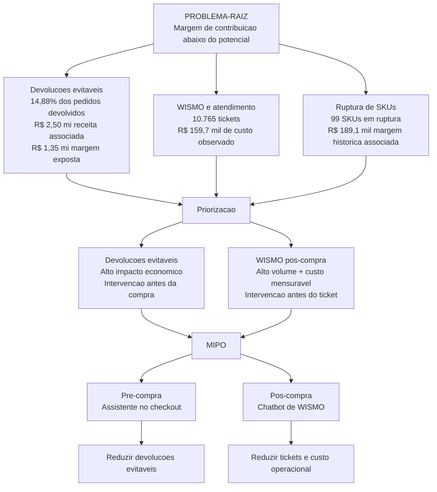

# Relatorio de evidencias para sustentar o MIPO

## 1. Objetivo

Este relatorio consolida evidencias dos notebooks e bases do case Vertice para sustentar a proposta do **MIPO (Motor Inteligente de Priorizacao Operacional)**.

O foco nao e provar economia capturada, porque o MVP ainda nao esta em producao. O foco e demonstrar que os dados atuais sustentam uma solucao que atua em dois momentos da jornada:

1. **Pre-compra:** orientar o cliente no checkout para reduzir risco de devolucao por tamanho, defeito, expectativa ou disponibilidade.
2. **Pos-compra:** apoiar o chatbot WISMO para reduzir tickets de rastreamento com respostas confiaveis e escalonamento com contexto.

Frase de sustentacao:

> Os dados mostram sintomas materiais em devolucoes, atendimento WISMO e disponibilidade. O MIPO transforma esses sintomas em intervencoes no cliente e em registros operacionais para o gestor, sempre separando evidencia observada de impacto estimado.

---

## 2. Fontes revisadas

Foram revisados os arquivos em `case/`:

| Fonte | Papel na sustentacao |
|---|---|
| `analise_dados.ipynb` | EDA inicial: explora vendas, margem, devolucoes, atendimento, estoque e clientes. |
| `analise_dados_v2.ipynb` | Revisao metodologica: valida qualidade, robustez, limites de ML e decisoes defensaveis. |
| `analise_margem_issue_tree.ipynb` | Investigacao focada em margem: separa hipoteses, evidencias, impacto estimado e limitacoes. |
| `data/vendas.csv` | Base de pedidos, margem, frete, devolucao e motivo de devolucao. |
| `data/atendimento.csv` | Base de tickets, categoria, CSAT, custo operacional e canal de entrada. |
| `data/estoque.csv` | Snapshot de disponibilidade por SKU. |
| `data/clientes.csv` e `data/marketing.csv` | Contexto adicional, com restricoes de atribuicao para decisoes avancadas. |

---

## 3. Evidencias principais

### 3.1 Devolucoes sustentam o assistente no checkout

Na base financeira filtrada para pedidos aprovados e validos:

| Indicador | Valor observado |
|---|---:|
| Pedidos aprovados validos | 24.454 |
| Pedidos devolvidos | 3.639 |
| Taxa de devolucao | 14,88% |
| Receita liquida associada a pedidos devolvidos | R$ 2.500.436,46 |
| Margem de contribuicao registrada nesses pedidos | R$ 1.351.707,09 |
| Frete registrado nesses pedidos | R$ 45.161,37 |

Distribuicao dos motivos de devolucao:

| Motivo | Pedidos | Share das devolucoes | Receita liquida associada | Frete registrado |
|---|---:|---:|---:|---:|
| Produto com defeito | 919 | 25,25% | R$ 647.605,97 | R$ 11.165,70 |
| Tamanho errado | 911 | 25,03% | R$ 614.352,41 | R$ 11.346,77 |
| Atraso na entrega | 711 | 19,54% | R$ 473.223,48 | R$ 9.808,78 |
| Nao gostei | 589 | 16,19% | R$ 420.333,19 | R$ 6.362,82 |
| Arrependimento | 509 | 13,99% | R$ 344.921,41 | R$ 6.477,30 |

Leitura para a solucao:

- **Defeito + tamanho errado somam 1.830 devolucoes**, equivalentes a **50,29%** das devolucoes aprovadas.
- Esses dois motivos concentram **R$ 1.261.958,38** de receita liquida associada e **R$ 22.512,47** de frete registrado.
- Incluindo atraso na entrega, os tres motivos mais acionaveis somam **2.541 devolucoes**, ou **69,83%** das devolucoes.

Como isso sustenta o MIPO:

- O assistente de checkout se justifica porque tamanho errado e defeito aparecem como causas relevantes de devolucao.
- O MVP pode comecar por uma intervencao simples: recomendar tamanho, sugerir produto similar ou pedir confirmacao consciente quando o historico indicar risco.
- O impacto exibido deve ser tratado como **potencialmente evitavel**, nao como economia comprovada.

---

### 3.2 Atendimento WISMO sustenta o chatbot pos-compra

Na base de atendimento:

| Indicador | Valor observado |
|---|---:|
| Total de tickets validos | 35.840 |
| Custo operacional total registrado | R$ 532.260,00 |
| CSAT medio geral | 3,24 |
| Tickets "Onde esta meu pedido?" | 10.765 |
| Participacao WISMO no atendimento | 30,04% |
| Custo operacional WISMO | R$ 159.660,00 |
| CSAT medio WISMO | 2,99 |

Categorias de atendimento mais relevantes:

| Categoria | Tickets | Custo | CSAT medio | Share |
|---|---:|---:|---:|---:|
| Onde esta meu pedido? | 10.765 | R$ 159.660,00 | 2,99 | 30,04% |
| Defeito | 6.509 | R$ 96.592,00 | 2,82 | 18,16% |
| Troca de Tamanho | 5.360 | R$ 79.325,00 | 2,99 | 14,96% |
| Duvida Tecnica | 5.314 | R$ 78.888,00 | 3,83 | 14,83% |
| Pagamento nao aprovado | 4.281 | R$ 63.856,00 | 2,99 | 11,94% |
| Elogio | 3.611 | R$ 53.939,00 | 4,57 | 10,08% |

Leitura para a solucao:

- WISMO e o maior bloco de atendimento, com **30,04% dos tickets**.
- A categoria tem CSAT **abaixo da media geral**.
- A base mostra que o cliente procura atendimento para obter informacao operacional que poderia ser antecipada ou respondida por autoatendimento.

Como isso sustenta o MIPO:

- O chatbot nao deve ser vendido como produto generico.
- Ele deve ser apresentado como **canal WISMO**: consulta status consolidado, responde prazo/ultimo evento e escala casos sem atualizacao.
- A acao concreta e reduzir atrito e fila humana em perguntas repetitivas de rastreamento.

---

### 3.3 Estoque e disponibilidade sustentam priorizacao operacional

Na base de estoque:

| Status | SKUs | Estoque disponivel | Participacao no catalogo |
|---|---:|---:|---:|
| Em Estoque | 3.993 | 1.319.854 | 79,86% |
| Estoque Critico | 701 | 34.962 | 14,02% |
| Descontinuado | 207 | 65.266 | 4,14% |
| Ruptura | 99 | 0 | 1,98% |

Indicadores complementares:

- **800 SKUs** estao em ruptura ou estoque critico.
- Desses, **784 tinham historico de venda** na base aprovada.
- A margem historica associada aos SKUs em ruptura/critico e de aproximadamente **R$ 1.411.258,50**.

Leitura para a solucao:

- O estoque aparece como risco operacional relevante, mas a base e um **snapshot**, nao uma serie historica diaria.
- Portanto, nao e correto afirmar que a empresa perdeu R$ 1,41 milhao por ruptura.
- A formulacao correta e: ha SKUs em risco que merecem priorizacao por demanda, margem, lead time e disponibilidade.

Como isso sustenta o MIPO:

- No checkout, disponibilidade baixa pode virar alerta ou sugestao de alternativa.
- No painel gestor, SKUs em risco podem virar fila de acao: revisar exposicao, sugerir similar, acionar compras ou ajustar comunicacao.
- A decisao critica, como comprar automaticamente, deve ficar fora do MVP.

---

### 3.4 Frete e margem sustentam o tema de compressao de margem

Usando apenas pedidos aprovados e validos:

| Recorte | Pedidos | Receita liquida | Margem % | Frete % | Frete registrado |
|---|---:|---:|---:|---:|---:|
| Geral | 24.454 | R$ 16.668.956,49 | 54,34% | 1,79% | R$ 297.770,68 |
| Marketplace | 5.315 | R$ 3.527.694,64 | 51,50% | 4,90% | R$ 172.828,86 |
| Nao Marketplace | 19.139 | R$ 13.141.261,85 | 55,11% | 0,95% | R$ 124.941,82 |

Leitura para a solucao:

- O Marketplace tem margem inferior e frete proporcionalmente maior.
- Esse achado sustenta a narrativa de compressao de margem, mas nao e o foco principal do MVP atual.
- Ele ajuda a explicar por que reduzir devolucoes e WISMO importa: frete, atendimento e retrabalho corroem margem operacional.

Como isso sustenta o MIPO:

- O MIPO pode exibir impacto estimado em frete reverso e custo operacional.
- O MVP deve tratar os valores como **cenario**, nao como captura automatica.

---

## 4. Issue tree da solucao

A issue tree abaixo organiza o problema de margem a partir das evidencias revisadas. Ela aparece em duas formas:

1. uma **versao visual de priorizacao**, mais adequada para pitch e alinhamento da equipe;
2. uma **versao analitica detalhada**, mais adequada para justificar tecnicamente cada decisao do MVP.

Ruptura aparece como evidencia operacional relevante, mas fica como apoio/roadmap porque a base de estoque e um snapshot e nao permite provar perda historica.

### 4.1 Versao visual de priorizacao

Problema-raiz:

```text
PROBLEMA-RAIZ
   MARGEM DE CONTRIBUICAO ABAIXO DO POTENCIAL
                        |
        +---------------+---------------+
        |               |               |
        v               v               v
   DEVOLUCOES        WISMO          RUPTURA DE
    EVITAVEIS     E ATENDIMENTO        SKUs
        |               |               |
   14,88% dos       10.765 tickets   99 SKUs em
   pedidos          R$ 159,7 mil     ruptura
   devolvidos       de custo         R$ 189,1 mil
        |               |            de margem historica
   R$ 2,50 mi        |               |
   receita           |               |
   R$ 1,35 mi        |               |
   margem exposta    |               |
        |               |               |
        +---------------+---------------+
                        |
                        v
                 PRIORIZACAO
                        |
             +----------+----------+
             |                     |
             v                     v
       DEVOLUCOES                WISMO
       EVITAVEIS              POS-COMPRA
             |                     |
      Alto impacto           Alto volume +
      economico              custo mensuravel
      + intervencao          + intervencao
      antes da compra        antes do ticket
             |                     |
             +----------+----------+
                        |
                        v
                      MIPO
                        |
              +---------+---------+
              |                   |
              v                   v
        PRE-COMPRA            POS-COMPRA
        Assistente             Chatbot
        no checkout            de WISMO
              |                   |
              v                   v
       Reduzir devolucoes   Reduzir tickets
           evitaveis        e custo operacional
```

Leitura da issue tree:

- **Devolucoes evitaveis** sao priorizadas porque combinam volume relevante, impacto economico e possibilidade de intervencao antes da compra.
- **WISMO pos-compra** e priorizado porque concentra alto volume de atendimento, custo mensuravel e uma acao clara antes do ticket escalar: responder status, prazo e ultimo evento.
- **Ruptura de SKUs** sustenta a importancia de priorizacao operacional, mas nao entra como nucleo do MVP porque o estoque e um snapshot. A margem historica associada aos SKUs em ruptura ajuda a priorizar investigacao, nao prova perda causada por ruptura.
- O **MIPO** nasce como motor de priorizacao porque escolhe onde agir primeiro e transforma evidencia em intervencao: assistente no checkout e chatbot de WISMO.

Traducao para componentes do MIPO:

| Ramo da issue tree | Componente do MIPO | Evidencia-chave | Decisao de MVP |
|---|---|---|---|
| Devolucoes evitaveis | Assistente no checkout | 14,88% dos pedidos aprovados devolvidos; R$ 1,35 mi de margem exposta | Recomendar tamanho, produto similar ou confirmacao consciente |
| WISMO e atendimento | Chatbot WISMO | 10.765 tickets; R$ 159,7 mil de custo observado | Responder status/prazo e escalar excecoes com contexto |
| Ruptura de SKUs | Apoio ao painel/roadmap | 99 SKUs em ruptura; R$ 189,1 mil de margem historica associada | Usar como criterio de priorizacao, nao como perda comprovada |
| Priorizacao | MIPO | Dois ramos com acao direta e impacto mensuravel | Focar pre-compra e pos-compra no MVP |

### 4.2 Versao visual em Mermaid



### 4.3 Issue tree analitica detalhada

Esta versao detalha como cada ramo se conecta a evidencias, acao do MIPO e limite de afirmacao.

```text
MARGEM DE CONTRIBUICAO ABAIXO DO POTENCIAL
|
|-- 1. Devolucoes evitaveis antes ou no momento da compra
|   |
|   |-- 1.1 Cliente escolhe tamanho/produto com maior risco de devolucao
|   |   |-- Evidencia: 3.639 devolucoes em pedidos aprovados
|   |   |-- Evidencia: taxa de devolucao de 14,88%
|   |   |-- Evidencia: tamanho errado = 911 devolucoes, 25,03% das devolucoes
|   |   |-- Acao MIPO: recomendar tamanho alternativo no checkout
|   |   |-- Saida esperada: cliente aceita/ignora e decisao fica registrada
|   |
|   |-- 1.2 Produto com sinal de defeito ou qualidade
|   |   |-- Evidencia: produto com defeito = 919 devolucoes, 25,25% das devolucoes
|   |   |-- Evidencia: defeito + tamanho = 50,29% das devolucoes aprovadas
|   |   |-- Acao MIPO: sugerir produto similar ou confirmacao consciente
|   |   |-- Saida esperada: reduzir compra de item com maior risco operacional
|   |
|   |-- 1.3 Baixa disponibilidade influencia decisao do cliente
|       |-- Evidencia: 701 SKUs em estoque critico e 99 em ruptura
|       |-- Evidencia: 800 SKUs em risco de disponibilidade
|       |-- Acao MIPO: alertar disponibilidade e sugerir alternativa
|       |-- Limite: snapshot de estoque nao prova perda historica
|
|-- 2. WISMO e atendimento depois da compra
|   |
|   |-- 2.1 Cliente abre ticket para saber status do pedido
|   |   |-- Evidencia: WISMO = 10.765 tickets
|   |   |-- Evidencia: WISMO = 30,04% do atendimento
|   |   |-- Evidencia: custo operacional WISMO = R$ 159.660,00
|   |   |-- Evidencia: CSAT WISMO = 2,99
|   |   |-- Acao MIPO: chatbot responde status, prazo e ultimo evento
|   |   |-- Saida esperada: resolver pergunta simples sem fila humana
|   |
|   |-- 2.2 Pedido sem atualizacao exige intervencao humana com contexto
|       |-- Evidencia: tickets de rastreamento indicam baixa visibilidade do pedido
|       |-- Acao MIPO: escalar caso critico com pedido, status e motivo
|       |-- Saida esperada: atendimento recebe contexto em vez de recomecar diagnostico
|
|-- 3. Priorizacao operacional para gestor
|   |
|   |-- 3.1 Gestor nao tem fila priorizada de produto/pedido/SKU critico
|   |   |-- Evidencia: devolucao, WISMO e estoque aparecem em bases separadas
|   |   |-- Evidencia: 800 SKUs em ruptura/critico precisam de priorizacao
|   |   |-- Acao MIPO: painel registra intervencoes e casos criticos
|   |   |-- Saida esperada: fila de acao por impacto, urgencia e evidencia
|   |
|   |-- 3.2 Frete e atendimento corroem margem, mas ganho real depende de acao
|       |-- Evidencia: frete Marketplace = 4,90% da receita liquida
|       |-- Evidencia: frete nao Marketplace = 0,95%
|       |-- Evidencia: custo total de atendimento = R$ 532.260,00
|       |-- Acao MIPO: simulador de impacto potencial
|       |-- Limite: impacto estimado nao e economia capturada
|
|-- 4. Hipoteses que nao devem guiar o MVP agora
    |
    |-- 4.1 Predicao individual de devolucao por ML
    |   |-- Evidencia: ROC-AUC temporal = 0,497
    |   |-- Decisao: NO-GO para modelo preditivo no MVP
    |
    |-- 4.2 Classificacao automatica de tickets por ML
    |   |-- Evidencia: apenas 30 textos unicos
    |   |-- Evidencia: macro F1 em frases novas = 0,237
    |   |-- Decisao: usar fluxo WISMO por regras
    |
    |-- 4.3 Otimizacao automatica de marketing
        |-- Evidencia: sem chave confiavel campanha -> pedido -> cliente
        |-- Decisao: deixar para roadmap, nao para MVP
```

---

## 5. Evidencias negativas e limites importantes

Os notebooks tambem mostram o que **nao** deve ser prometido.

### 5.1 Predicao individual de devolucao ainda nao e defensavel

O `analise_dados_v2.ipynb` testou um baseline temporal de risco de devolucao:

| Modelo | ROC-AUC temporal | Limiar de go | Decisao |
|---|---:|---:|---|
| Regressao logistica - risco de devolucao | 0,497 | 0,60 | NO-GO |

Interpretacao:

- O modelo performou proximo do acaso.
- Portanto, o MVP nao deve prometer predicao individual robusta de devolucao.
- A versao defensavel e usar regras e evidencias agregadas por produto/tamanho/motivo.

### 5.2 Classificacao automatica de tickets ainda nao generaliza

O notebook identificou que a base de atendimento possui apenas **30 textos unicos**. O classificador teve:

| Avaliacao | Accuracy | Macro F1 | Risco |
|---|---:|---:|---|
| Split aleatorio por linha | 1,000 | 1,000 | Memorizacao de frases repetidas |
| Frases inteiras nao vistas | 0,268 | 0,237 | Baixa generalizacao |

Interpretacao:

- O chatbot WISMO nao deve depender de um classificador treinado nessa base.
- O MVP deve usar fluxo por regras: identificar pedido, consultar status, responder prazo/ultimo evento e escalar casos criticos.

### 5.3 Marketing e LTV nao sustentam otimizacao automatica

O `analise_dados_v2.ipynb` aponta:

- ausencia de chave confiavel campanha -> pedido -> cliente;
- janelas temporais diferentes entre marketing, vendas e atendimento;
- apenas parte das bases fica na janela temporal comum.

Interpretacao:

- Nao e defensavel prometer otimizacao automatica de marketing por margem/LTV no MVP.
- Marketing pode ficar como contexto ou roadmap, nao como nucleo da solucao.

### 5.4 Ruptura nao pode ser vendida como perda historica comprovada

A base de estoque e um retrato de disponibilidade, nao um historico diario de rupturas.

Interpretacao:

- E correto dizer que existem SKUs em risco.
- Nao e correto dizer que a margem historica associada a esses SKUs foi perdida por ruptura.

---

## 6. Como as evidencias sustentam cada parte do MIPO

| Componente do MIPO | Evidencia que sustenta | O que o MVP pode fazer | Limite de afirmacao |
|---|---|---|---|
| Assistente no checkout | 14,88% de devolucao; 50,29% das devolucoes por defeito+tamanho | Recomendar tamanho, similar ou confirmacao consciente | Nao prometer predicao individual perfeita |
| Chatbot WISMO | 10.765 tickets WISMO; 30,04% do atendimento; R$ 159.660 de custo observado | Responder status/prazo e escalar com contexto | Nao prometer eliminar todo atendimento |
| Painel do gestor | Eventos de intervencao e atendimento podem ser registrados | Mostrar aceite, recusa, escalonamento e impacto estimado | Impacto e potencial, nao ganho realizado |
| Priorizacao operacional | 800 SKUs em ruptura/critico; devolucoes e WISMO concentrados | Criar fila de produto/pedido/SKU critico | Snapshot de estoque nao prova perda historica |
| Simulador de impacto | Frete, custo de ticket e margem estao nos dados | Calcular cenarios editaveis | Cenários dependem de premissas |

---

## 7. Tese de sustentacao para pitch

Versao curta:

> Os dados da Vertice mostram tres sintomas materiais: devolucoes concentradas em defeito e tamanho, WISMO como maior categoria de atendimento e estoque com 800 SKUs em risco. O MIPO usa esses sinais para agir antes da perda: no checkout, orienta a escolha do cliente; no pos-compra, responde WISMO com status consolidado; e no painel, registra cada intervencao para que o gestor acompanhe aceite, escalonamento e impacto estimado.

Versao mais executiva:

> A proposta nao depende de uma IA que inventa previsoes. As evidencias mostram onde ha atrito operacional observavel. O MIPO transforma esses atritos em acoes controladas: recomendacao de tamanho ou alternativa no checkout, atendimento WISMO por regras e priorizacao operacional para o gestor. Os calculos sao deterministicos e a IA entra como camada de explicacao e comunicacao.

---

## 8. Recomendacao para o MVP

Com base nas evidencias, o MVP de duas semanas deve priorizar:

1. **Fluxo de checkout com recomendacao por risco agregado**
   - Usar produto, tamanho, historico de devolucao, motivo e estoque.
   - Exibir recomendacao simples.
   - Registrar aceite ou recusa.

2. **Chatbot WISMO por regras**
   - Consultar pedido mockado/consolidado.
   - Responder dentro do prazo, atrasado ou sem atualizacao.
   - Escalar com contexto quando necessario.

3. **Painel de evidencias e impacto**
   - Mostrar quantidade de intervencoes.
   - Mostrar aceite/recusa.
   - Mostrar WISMO resolvido/escalado.
   - Mostrar frete reverso e custo de atendimento potencialmente evitaveis.

4. **Bloco de limitacoes**
   - Deixar claro que o impacto e estimado.
   - Explicar que ML preditivo, otimizacao de marketing e reposicao automatica ficam fora do MVP.

---

## 9. Conclusao

As bases sustentam a ideia do MIPO porque mostram problemas concentrados, mensuraveis e acionaveis:

- devolucoes por defeito e tamanho representam metade das devolucoes aprovadas;
- WISMO representa quase um terco dos tickets de atendimento;
- estoque critico e ruptura aparecem em 800 SKUs;
- frete e atendimento sao custos observaveis que podem entrar no simulador.

Ao mesmo tempo, os notebooks mostram que a solucao deve ser cuidadosa: nao ha base suficiente para prometer modelos preditivos robustos, otimizacao automatica de marketing ou ganho financeiro comprovado antes da operacao.

Portanto, a formulacao mais defensavel e:

> O MIPO e um motor de priorizacao e intervencao operacional que usa evidencias observadas para orientar o cliente e apoiar o gestor, medindo impacto potencial de forma transparente.
