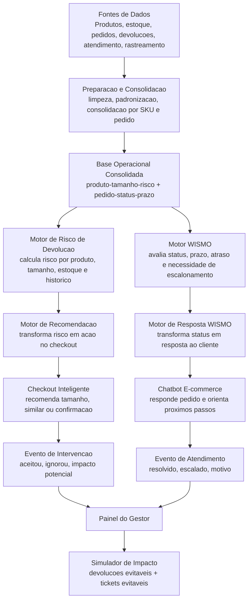
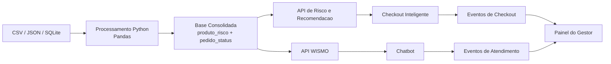
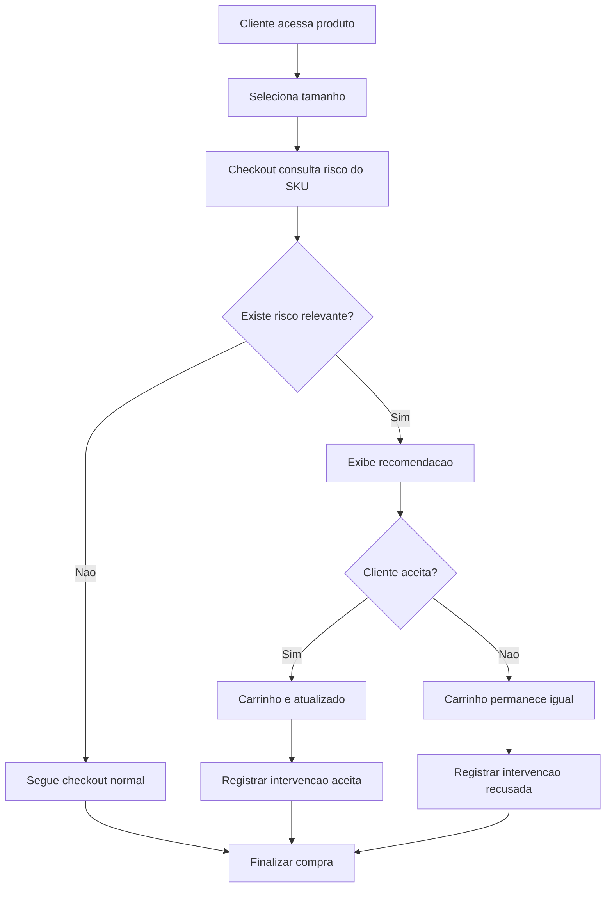
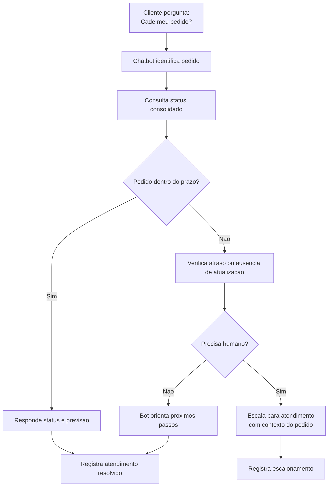
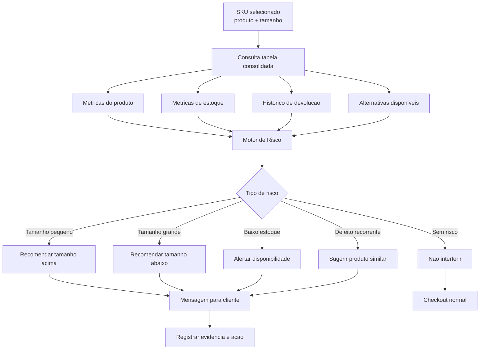
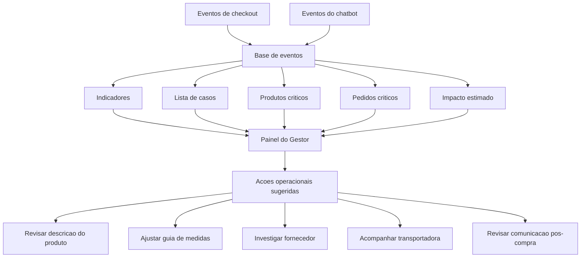

# Relatorio do MVP - MIPO

> **Status de escopo — setembro de 2026:** a entrega executável cobre a jornada
> pré-compra e um incremento pós-compra WISMO. O WISMO usa régua logística
> determinística e dados históricos ou demonstração explicitamente rotulada;
> tracking em tempo real e persistência de atendimentos no Supabase permanecem
> fora do escopo atual.

## 1. Resumo executivo

O MVP do **MIPO (Motor Inteligente de Priorizacao Operacional)** tem como objetivo demonstrar que a solucao nao apenas analisa dados historicos, mas **intervem na jornada do cliente antes que problemas virem devolucao, ticket, retrabalho ou perda de margem**.

O MVP atua em dois momentos da jornada:

1. **Pre-compra:** assistente no checkout recomenda tamanho, produto similar ou confirmacao consciente para reduzir devolucoes evitaveis.
2. **Pos-compra:** chatbot do e-commerce responde perguntas de WISMO, ou seja, "cade meu pedido?", usando status consolidado e escalando casos criticos com contexto.

A entrega central e uma experiencia demonstravel em que dados de produto, estoque, devolucao, atendimento e rastreamento viram acoes concretas para o cliente e registros operacionais para o gestor.

Frase central do MVP:

> O MIPO protege margem atuando antes da perda: no checkout, reduz risco de devolucao; no pos-compra, reduz tickets WISMO com respostas confiaveis e escalonamento estruturado.

---

## 2. Problema que o MVP resolve

A Vertice possui sinais de compressao de margem associados a problemas operacionais e de experiencia do cliente. Entre eles:

- devolucoes por tamanho errado, expectativa diferente ou defeito;
- custo de frete reverso e retrabalho operacional;
- tickets de rastreamento, especialmente "onde esta meu pedido?";
- cliente com pouca visibilidade sobre pedido;
- gestor sem uma fila clara de intervencoes e aprendizados.

O problema principal nao e falta de dados. O problema e que muitos sinais aparecem tarde, quando ja viraram custo.

O MVP responde a essa dor ao transformar dados historicos e operacionais em duas acoes visiveis:

- uma recomendacao no checkout antes da compra;
- uma resposta estruturada no chatbot antes do cliente abrir ou escalar um ticket.

---

## 3. Objetivo do MVP

O MVP deve provar o seguinte fluxo de valor:

```text
dados historicos e operacionais
-> deteccao de risco/status
-> recomendacao ou resposta ao cliente
-> registro da decisao/interacao
-> painel do gestor
-> impacto estimado
```

Em termos praticos, o MVP precisa demonstrar que:

- a solucao consegue identificar risco de devolucao no checkout;
- a solucao consegue orientar o cliente antes da compra;
- a solucao consegue responder WISMO no pos-compra;
- a solucao registra as intervencoes realizadas;
- o gestor consegue acompanhar aceite, escalonamento, produtos criticos, pedidos criticos e impacto estimado.

---

## 4. Escopo do MVP

### Incluido

- Prototipo navegavel do checkout inteligente.
- Recomendacao de tamanho, produto similar ou alerta de disponibilidade.
- Registro de intervencoes no checkout.
- Painel do gestor.
- Simulador de impacto estimado.
- Diagramas e arquitetura do fluxo ponta a ponta.
- Concierge de moda e auditoria de sacola como capacidades experimentais,
  separadas do núcleo determinístico do MIPO.
- Consulta WISMO por pedido, régua logística determinística, interface de
  atendimento, indicadores locais e simulador de impacto rotulado como cenário.

### Fora do MVP

- Integracao real com ERP, WMS, TMS ou gateway de pagamento.
- Compra automatica ou reposicao automatica.
- Logistica real em tempo real.
- Chatbot generico para todos os assuntos.
- Tracking logístico em tempo real e integração com transportadoras.
- Persistência de atendimentos WISMO no Supabase; o modo atual é local/demo.
- Previsao avancada de demanda.
- Garantia de economia real capturada.
- IA tomando decisoes criticas sem regras ou validacao humana.

---

## 5. Jornada do MVP

O MVP tem duas jornadas principais.

### Jornada 1 - Pre-compra: assistente no checkout

Objetivo: reduzir devolucoes evitaveis antes da compra.

Fluxo:

```text
cliente acessa produto
-> seleciona tamanho
-> sistema consulta risco do SKU
-> sistema detecta risco de devolucao, estoque ou qualidade
-> checkout exibe recomendacao
-> cliente aceita ou ignora
-> sistema registra a intervencao
-> gestor acompanha resultado e impacto estimado
```

Exemplo:

```text
Produto: Calca Wide Leg Preta
Tamanho selecionado: M
Taxa de devolucao do tamanho M: 34%
Motivo principal: tamanho pequeno
Tamanho G disponivel: sim
Taxa de devolucao do G: 16%

Recomendacao:
Este modelo costuma ter forma menor. Para reduzir chance de troca ou devolucao, recomendamos o tamanho G.

Acoes:
[Usar tamanho G] [Continuar com M]
```

Se o cliente aceita, o carrinho e atualizado. Se ignora, o carrinho permanece igual. Nos dois casos, a decisao e registrada.

### Jornada 2 - Pos-compra: chatbot WISMO

Objetivo: reduzir tickets de rastreamento e melhorar a visibilidade do pedido.

Fluxo:

```text
cliente pergunta "cade meu pedido?"
-> chatbot identifica o pedido
-> consulta status consolidado
-> verifica prazo, ultimo evento e necessidade de escalonamento
-> responde ao cliente
-> se necessario, escala para atendimento humano com contexto
-> sistema registra atendimento resolvido ou escalado
-> gestor acompanha casos e impacto estimado
```

Exemplo de resposta dentro do prazo:

```text
Seu pedido esta em transporte e a previsao de entrega e ate 12/09.
A ultima atualizacao foi em 09/09 as 14h: saiu do centro de distribuicao.
```

Exemplo de resposta com problema:

```text
Seu pedido esta sem atualizacao ha mais tempo que o esperado.
Ja registrei uma verificacao para o time de atendimento acompanhar com a transportadora.
Voce recebera uma nova atualizacao por este canal.
```

---

## 6. Entradas do sistema

### Dados de produto

- ID do produto.
- SKU.
- Nome.
- Categoria.
- Tamanho.
- Cor.
- Modelo.
- Descricao.
- Fornecedor.
- Preco.
- Margem estimada.
- Atributos relevantes, como tecido, forma e caimento.

### Dados de estoque

- Estoque disponivel por SKU/tamanho.
- Estoque de tamanhos alternativos.
- Estoque de produtos similares.
- Status: disponivel, baixo estoque ou ruptura.

### Dados de pedidos

- Numero do pedido.
- Cliente.
- Produto comprado.
- Tamanho escolhido.
- Data da compra.
- Valor.
- Status atual.
- Prazo prometido.

### Dados de devolucoes

- Produto devolvido.
- Tamanho devolvido.
- Motivo da devolucao.
- Taxa de devolucao por produto.
- Taxa de devolucao por tamanho.
- Frete reverso medio.
- Custo operacional medio, se disponivel.

### Dados de atendimento

- Tickets por produto ou pedido.
- Motivo do contato.
- Menções a tamanho, defeito, qualidade, atraso ou rastreamento.
- CSAT, se disponivel.
- Historico de escalonamento.

### Dados de rastreamento

- Transportadora.
- Ultimo evento.
- Data/hora do ultimo evento.
- Status logistico.
- Previsao de entrega.
- Indicador de atraso.
- Indicador de ausencia de atualizacao.

---

## 7. Saidas do sistema

### Saida para o cliente no checkout

Mensagem objetiva e acionavel:

```text
Este modelo costuma ter forma menor.
Clientes que escolheram M devolveram este item com mais frequencia por ajuste apertado.
Recomendamos o tamanho G.

[Usar tamanho G] [Continuar com M]
```

Outros exemplos:

```text
Restam apenas 2 unidades neste tamanho.
Voce tambem pode considerar este produto similar com menor historico de devolucao.
```

```text
Este produto teve aumento recente de devolucoes por defeito.
Sugerimos revisar uma alternativa com melhor historico de satisfacao.
```

### Saida para o cliente no chatbot

Resposta de status ou proximo passo:

```text
Seu pedido esta em transporte.
Previsao de entrega: ate 12/09.
Ultima atualizacao: saiu do centro de distribuicao em 09/09 as 14h.
```

Ou:

```text
Seu pedido esta sem atualizacao ha 72h.
Ja abri uma verificacao para o atendimento acompanhar com a transportadora.
```

### Saida para o gestor

Painel com:

- intervencoes no checkout;
- recomendacoes aceitas;
- recomendacoes ignoradas;
- taxa de aceite;
- produtos com maior risco;
- pedidos criticos;
- atendimentos WISMO resolvidos pelo bot;
- casos escalados para humano;
- frete reverso potencialmente evitado;
- tickets potencialmente evitados;
- acoes operacionais sugeridas.

---

## 8. Arquitetura funcional do MVP



---

## 9. Arquitetura tecnica sugerida

Para duas semanas de desenvolvimento, a arquitetura tecnica deve ser simples, demonstravel e facil de explicar.

```text
Frontend:
React, Next.js ou HTML/CSS/JS prototipavel

Backend:
FastAPI, Flask ou API simples em Node/Python

Dados:
CSV tratado, JSON ou SQLite

Processamento:
Python + Pandas

Motores:
funcoes deterministicas para risco, recomendacao e WISMO

IA opcional:
geracao de texto explicativo para cliente e gestor

Dashboard:
cards, tabelas, filtros simples e simulador
```

Fluxo tecnico:



---

## 10. Detalhamento das camadas

### 10.1 Fontes de dados

Reunem os dados necessarios para entender produto, pedido, cliente, devolucao, estoque e atendimento.

No MVP, essas fontes podem ser simuladas ou derivadas das bases do case.

### 10.2 Preparacao e consolidacao

Responsavel por:

- limpar dados;
- padronizar IDs de SKU;
- normalizar tamanhos;
- relacionar produto com estoque;
- relacionar produto com devolucao;
- relacionar pedido com status;
- gerar tabelas consolidadas.

Saidas principais:

```text
tabela_produto_tamanho_risco
tabela_pedido_status_prazo
tabela_eventos_intervencao
```

### 10.3 Motor de risco de devolucao

Calcula o risco antes da compra.

Indicadores:

- taxa de devolucao por produto;
- taxa de devolucao por tamanho;
- motivo dominante da devolucao;
- estoque do tamanho escolhido;
- disponibilidade de tamanhos alternativos;
- disponibilidade de produtos similares;
- sinais de defeito ou expectativa diferente.

Exemplo de regra:

```text
Se taxa_devolucao_tamanho >= 30%
e motivo_principal = "tamanho pequeno"
e tamanho_acima_disponivel = verdadeiro
entao risco = alto
```

### 10.4 Motor de recomendacao

Transforma risco em uma acao.

Regras:

```text
Risco por tamanho pequeno -> recomendar tamanho acima.
Risco por tamanho grande -> recomendar tamanho abaixo.
Risco por baixo estoque -> alertar disponibilidade ou sugerir similar.
Risco por defeito recorrente -> sugerir produto similar ou confirmacao consciente.
Sem risco relevante -> seguir checkout normal.
```

### 10.5 Checkout inteligente

E a interface do cliente no momento da compra.

Responsavel por:

- capturar produto e tamanho selecionado;
- consultar risco;
- exibir recomendacao;
- permitir aceitar ou ignorar;
- atualizar carrinho;
- registrar a intervencao.

### 10.6 Motor WISMO

Avalia perguntas de status de pedido.

Regras:

```text
Pedido dentro do prazo -> responder status e previsao.
Pedido atrasado -> explicar atraso e orientar proximo passo.
Pedido sem atualizacao -> abrir verificacao ou escalar.
Pedido entregue -> informar entrega e oferecer suporte se cliente contestar.
Pedido inconclusivo -> escalar para humano com contexto.
```

### 10.7 Chatbot do e-commerce

Canal de atendimento ao cliente no pos-compra.

Responsavel por:

- identificar pedido;
- consultar status consolidado;
- responder WISMO;
- reduzir atendimento humano quando o caso e simples;
- escalar com contexto quando necessario.

### 10.8 Registro de eventos

Toda acao vira evento.

Eventos de checkout:

```text
intervencao_id
produto original
produto/tamanho recomendado
tipo de risco
nivel de risco
acao recomendada
decisao do cliente
impacto potencial
data/hora
```

Eventos de chatbot:

```text
atendimento_id
pedido
pergunta do cliente
status consultado
resposta enviada
resolvido pelo bot
escalado para humano
motivo do escalonamento
```

### 10.9 Painel do gestor

Mostra o resultado operacional dos dois canais.

Indicadores:

- intervencoes no checkout;
- taxa de aceite;
- produtos com maior risco;
- pedidos sem atualizacao;
- atendimentos WISMO resolvidos pelo bot;
- casos escalados;
- impacto estimado em frete reverso;
- impacto estimado em tickets evitaveis.

---

## 11. Diagramas dos fluxos

### 11.1 Fluxo do checkout



### 11.2 Fluxo do chatbot WISMO



### 11.3 Motor de risco e recomendacao



### 11.4 Visao do gestor



---

## 12. Papel da IA

A IA deve ser usada como apoio de linguagem e explicacao, nao como fonte dos numeros.

### IA pode fazer

- Gerar mensagem clara para o cliente.
- Adaptar tom da recomendacao no checkout.
- Resumir evidencias para o gestor.
- Classificar ou resumir reclamacoes textuais, se houver dados.
- Gerar resposta do chatbot com base no status consolidado.

### IA nao deve fazer

- Inventar taxa de devolucao.
- Inventar margem.
- Inventar status de pedido.
- Tomar acao critica sem regra.
- Afirmar causalidade sem evidencia.
- Realizar compra ou reposicao automatica.

Divisao correta:

```text
Regras e analytics calculam.
IA explica, recomenda em linguagem natural e ajuda o cliente a decidir.
```

---

## 13. Simulador de impacto

O simulador e usado para demonstrar potencial, nao ganho comprovado.

### Entradas

- Numero de compras impactadas.
- Taxa media de devolucao.
- Taxa de aceite da recomendacao.
- Reducao estimada de devolucao apos aceite.
- Frete reverso medio.
- Custo medio de atendimento.
- Volume de perguntas WISMO.
- Percentual de WISMO resolvido pelo bot.

### Saidas

- Devolucoes potencialmente evitadas.
- Frete reverso potencialmente evitado.
- Tickets WISMO potencialmente evitados.
- Custo operacional potencialmente evitado.
- Impacto estimado na margem.

Exemplo:

```text
Compras impactadas: 1.000
Compras em risco: 200
Taxa de aceite: 55%
Reducao estimada de devolucao: 30%
Frete reverso medio: R$ 22,50

Clientes que aceitariam recomendacao: 110
Devolucoes potencialmente evitadas: 33
Frete reverso potencialmente evitado: R$ 742,50
```

Observacao importante:

> O impacto do MVP e estimado. Economia real so pode ser comprovada apos teste operacional com grupo de controle ou acompanhamento em producao.

---

## 14. Backlog sugerido para duas semanas

### Semana 1

**Dia 1 - Escopo e dados**

- Fechar os produtos/categorias usados na demo.
- Definir regras de risco.
- Definir dados mockados ou derivados do case.
- Criar estrutura das tabelas consolidadas.

**Dia 2 - Preparacao dos dados**

- Criar base produto-tamanho-risco.
- Criar base pedido-status-prazo.
- Criar exemplos de devolucao, estoque e rastreamento.

**Dia 3 - Motores**

- Implementar motor de risco de devolucao.
- Implementar motor de recomendacao.
- Implementar motor WISMO.

**Dia 4 - Checkout**

- Criar tela de produto/checkout.
- Exibir recomendacao.
- Permitir aceitar ou ignorar.
- Registrar evento.

**Dia 5 - Chatbot**

- Criar fluxo WISMO.
- Permitir consulta de pedido.
- Responder dentro do prazo, atrasado ou sem atualizacao.
- Registrar resolucao ou escalonamento.

### Semana 2

**Dia 6 - Painel do gestor**

- Cards de indicadores.
- Lista de intervencoes.
- Lista de atendimentos WISMO.

**Dia 7 - Simulador**

- Premissas editaveis.
- Calculo de devolucoes evitaveis.
- Calculo de tickets evitaveis.

**Dia 8 - Polimento da demo**

- Melhorar UI.
- Ajustar textos.
- Conectar fluxo do cliente ao painel.

**Dia 9 - Roteiro de apresentacao**

- Criar narrativa antes/depois.
- Preparar exemplos de casos.
- Explicitar limitacoes.

**Dia 10 - Validacao final**

- Testar fluxo completo.
- Corrigir inconsistencias.
- Ensaiar apresentacao.

---

## 15. Criterios de sucesso do MVP

O MVP sera bem-sucedido se conseguir demonstrar:

- um cliente recebendo uma recomendacao antes da compra;
- uma decisao de aceitar ou ignorar sendo registrada;
- um chatbot respondendo WISMO com status confiavel;
- um caso critico sendo escalado com contexto;
- um gestor acompanhando os eventos;
- um impacto estimado sendo calculado;
- uma narrativa clara de prevencao de perda, e nao apenas analise historica.

---

## 16. Mensagem final para pitch

> O MIPO atua em dois pontos criticos da jornada do cliente. Antes da compra, o assistente no checkout identifica risco de devolucao por tamanho, estoque ou historico do produto e recomenda uma acao simples para o cliente. Depois da compra, o chatbot WISMO responde status do pedido com base consolidada e escala casos criticos com contexto. Cada interacao vira evento para o painel do gestor, permitindo acompanhar aceite, resolucao, produtos criticos, pedidos criticos e impacto estimado em margem. Assim, o MVP prova que a IA nao fica limitada a analise: ela participa da decisao do cliente e transforma dados em acao operacional.
