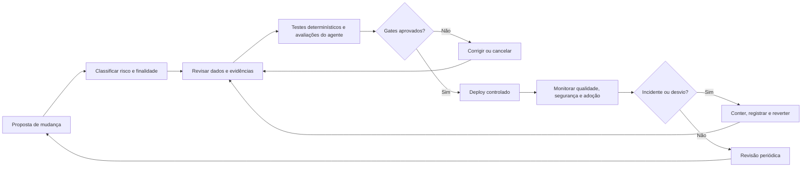
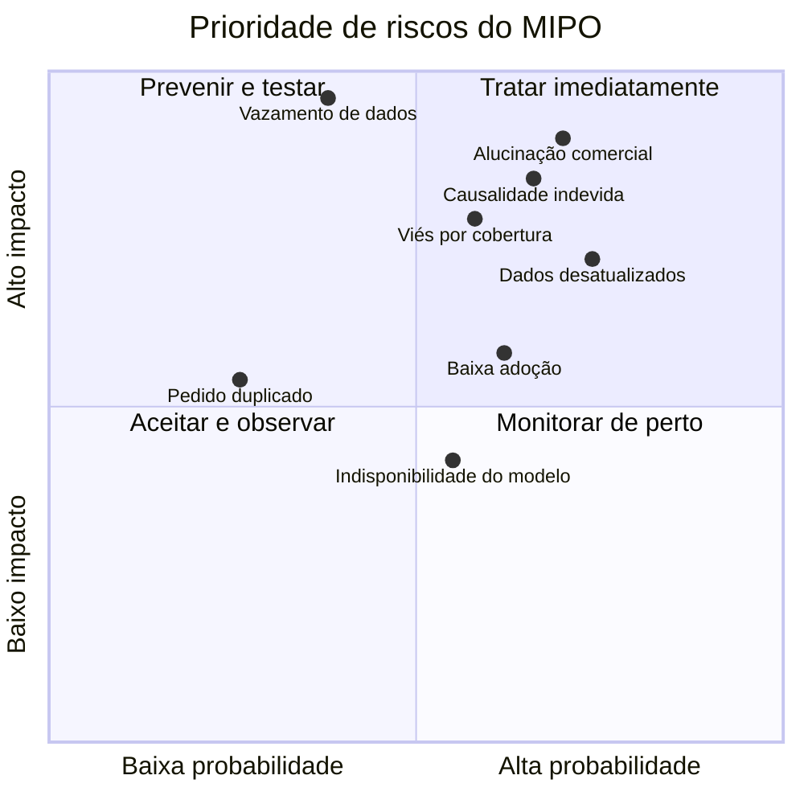

# Governança e riscos do MIPO

## 1. Objetivo e escopo

Este documento define como o MIPO deve ser operado, monitorado e evoluído com segurança. O escopo atual cobre a assistência pré-compra, a recomendação de tamanho ou alternativa, a explicação contextual do agente, o checkout demonstrativo, o experimento controle × tratamento e o painel gerencial.

WISMO permanece fora do escopo desta versão e no backlog. Resultados históricos, demonstrações, projeções e resultados observados do piloto devem continuar explicitamente separados.

## 2. Princípios de governança

1. **Decisão determinística, explicação assistida.** O motor de regras determina risco, recomendação e ações permitidas. O agente pode explicar o resultado, mas não alterar estoque, preço, variante, regra ou decisão.
2. **Evidência antes de afirmação.** Composição, elasticidade, cuidado, caimento e compatibilidade só podem ser informados quando existirem em fonte autorizada. Ausência de evidência deve resultar em `insufficient_evidence` ou em uma resposta explícita de dado não informado.
3. **Humano mantém a decisão.** A cliente pode aceitar a recomendação ou manter a escolha original. Mudanças de regra, publicação e interpretação de impacto exigem responsável humano.
4. **Minimização de dados.** O piloto deve usar sessão pseudônima, identificador de pedido demonstrativo e agregados. E-mail, endereço, nome, conversa livre e outros dados pessoais não devem ser persistidos sem finalidade e base legal aprovadas.
5. **Sem causalidade presumida.** Projeções são cenários. Impacto só pode ser atribuído ao MIPO depois de comparação válida entre controle e tratamento, desfechos suficientes e revisão analítica.
6. **Falha segura.** Indisponibilidade do modelo não bloqueia o checkout. O sistema retorna a decisão determinística ou informa que não possui evidência; nunca inventa uma resposta para preencher a ausência.
7. **Rastreabilidade proporcional.** Toda intervenção deve permitir reconstruir regra, evidência, decisão, origem, execução do agente e desfecho sem armazenar dados pessoais desnecessários.

## 3. Modelo de responsabilidades

| Papel | Responsabilidade | Aprovações obrigatórias |
|---|---|---|
| Product Owner | Escopo, valor para cliente e critérios de sucesso | Mudança de jornada, expansão de finalidade e início do piloto |
| Responsável de dados | Qualidade, linhagem, dicionário e retenção | Nova fonte, novo atributo sensível e mudança de regra de agregação |
| Engenharia | Contratos, segurança, disponibilidade, migrações e rollback | Deploy, mudança de schema e integração externa |
| Responsável pelo agente | Prompts, ferramentas autorizadas, avaliações e guardrails | Novo modelo, nova ferramenta ou ampliação das ações do agente |
| Privacidade/Segurança | Base legal, minimização, acesso e incidentes | Uso de PII, exportação, compartilhamento ou aumento de retenção |
| Operação/Atendimento | Feedback de uso, exceções e escalonamento | Mudança de procedimento operacional |
| Analista do experimento | Integridade dos grupos e leitura dos resultados | Encerramento do piloto e qualquer alegação causal |

Uma mesma pessoa pode acumular papéis no protótipo, mas a aprovação de mudança de regra, produção ou impacto não deve ser feita apenas por quem implementou a alteração.

## 4. Ciclo de controle

### Gates mínimos

| Gate | Evidência de aprovação |
|---|---|
| Dados | Schema validado, fonte identificada, qualidade medida e retenção definida |
| Domínio | Regras determinísticas e estados de evidência insuficiente cobertos por testes |
| Agente | Avaliações de alucinação, ação não autorizada, tamanho permitido, timeout e fallback aprovadas |
| Segurança | Segredos apenas no servidor, RLS ativa, privilégios mínimos e endpoints sensíveis protegidos |
| Experiência | Estados de loading, erro, vazio, teclado, contraste e mobile verificados |
| Experimento | Grupo atribuído antes da exposição, idempotência e desfecho rastreável |
| Impacto | Separação entre observado, associado, estimado e causal revisada por responsável humano |

## 5. Riscos e controles necessários

### 5.1 Dados e qualidade

- **Riscos:** catálogo incompleto, atributo incorreto, dados desatualizados, duplicidade de pedido, desfecho ausente, mudança silenciosa de schema e mistura entre demonstração e histórico.
- **Controles preventivos:** contratos tipados, validação de importação, hashes de origem, idempotência, enumerações de domínio, origem do dado visível e migrações versionadas.
- **Controles detectivos:** taxa de campos ausentes, rejeições de importação, divergência de schema, pedidos sem desfecho e reconciliação por grupo.
- **Resposta:** bloquear alegação comercial, marcar evidência insuficiente, corrigir a fonte e reprocessar apenas dados rastreáveis.

### 5.2 Privacidade e segurança

- **Riscos:** coleta excessiva no checkout, persistência de conversa livre, exposição de identificadores, acesso indevido ao painel, vazamento de segredo e reidentificação por cruzamento.
- **Controles preventivos:** pseudonimização de sessão, não persistência dos campos fictícios, agregação no painel, RLS, `service_role` somente no servidor, princípio do menor privilégio e segregação entre ambientes.
- **Controles detectivos:** auditoria de acesso, varredura de segredo, inventário de tabelas, revisão de payloads e alertas de volume anômalo.
- **Resposta:** suspender coleta, revogar credenciais, preservar evidências técnicas, avaliar titulares afetados e seguir o plano de incidente aplicável.

### 5.3 Vieses e tratamento desigual

- **Riscos:** recomendação pior para tamanhos menos representados, associação indevida entre preferência e corpo, catálogo com cobertura desigual e experimento desbalanceado.
- **Controles preventivos:** usar preferência declarada em vez de inferir características pessoais; não utilizar atributos sensíveis; estratificar cobertura e desempenho por tamanho, categoria e tipo de evidência.
- **Controles detectivos:** comparar taxa de intervenção, aceite, erro e devolução entre segmentos operacionais; investigar diferenças relevantes e intervalos de incerteza.
- **Resposta:** reduzir a abrangência, ajustar regras e catálogo, repetir validação e impedir escala enquanto o dano não for compreendido.

### 5.4 Alucinação e automação indevida

- **Riscos:** inventar composição, elasticidade, lavagem, estoque, desconto ou garantia; recomendar variante não autorizada; transformar explicação em decisão.
- **Controles preventivos:** contexto autorizado, ferramentas com schema fechado, lista de ações permitidas, guardrails de saída, motor determinístico soberano e fallback conservador.
- **Controles detectivos:** suíte de avaliações adversariais, taxa de rejeição, respostas sem evidência, divergência agente × regra e amostragem humana.
- **Resposta:** desativar o provedor ou a função afetada, manter fallback determinístico, registrar o caso e adicionar regressão antes da reativação.

### 5.5 Adoção pelo time e risco operacional

- **Riscos:** equipe interpretar score como verdade absoluta, contornar o fluxo, ignorar alertas, depender do agente ou comunicar projeção como economia realizada.
- **Controles preventivos:** treinamento por papel, glossário de indicadores, runbook, mensagens de origem no painel, decisões reversíveis e responsáveis nomeados.
- **Controles detectivos:** uso por etapa, abandono, decisões pendentes, feedback qualitativo e revisão de apresentações e relatórios.
- **Resposta:** reforçar treinamento, simplificar o fluxo, ajustar alertas e suspender indicadores mal interpretados.

### 5.6 Experimento e impacto

- **Riscos:** contaminação do controle, atribuição após exposição, amostra insuficiente, perda de desfechos, múltiplos testes e causalidade indevida.
- **Controles preventivos:** atribuição estável por sessão antes da intervenção, tratamento isolado, checkout idempotente, protocolo registrado e limiar mínimo de observações.
- **Controles detectivos:** proporção dos grupos, exposição indevida, cobertura de desfechos, diferença de composição e evolução temporal.
- **Resposta:** invalidar a janela contaminada, documentar a causa e reiniciar a coleta; não corrigir seletivamente resultados depois de observados.

## 6. Matriz visual de risco × oportunidade

Escala: probabilidade e impacto de 1 (baixo) a 5 (muito alto). O nível inerente é `probabilidade × impacto`, antes dos controles. O risco residual deve ser reavaliado trimestralmente e após qualquer mudança material.

| ID | Risco | P | I | Inerente | Controles-chave | Residual esperado | Responsável |
|---|---|---:|---:|---:|---|---:|---|
| R1 | Alucinação sobre produto ou política | 4 | 5 | 20 crítico | Evidência autorizada, guardrails, fallback e avaliações | 8 médio | Responsável pelo agente |
| R2 | Exposição ou uso indevido de dados pessoais | 2 | 5 | 10 alto | Minimização, RLS, acesso servidor e auditoria | 5 baixo | Privacidade/Segurança |
| R3 | Recomendação enviesada por cobertura desigual | 3 | 4 | 12 alto | Métricas por segmento, sem atributos sensíveis e revisão humana | 8 médio | Dados + Produto |
| R4 | Catálogo incompleto ou desatualizado | 4 | 4 | 16 crítico | Linhagem, validação e `insufficient_evidence` | 8 médio | Responsável de dados |
| R5 | Projeção apresentada como resultado causal | 4 | 5 | 20 crítico | Separação visual, protocolo e aprovação analítica | 5 baixo | Analista do experimento |
| R6 | Baixa adoção ou uso incorreto pelo time | 3 | 3 | 9 médio | Treinamento, runbook e indicadores de uso | 6 médio | Product Owner |
| R7 | Indisponibilidade ou latência do agente | 3 | 2 | 6 médio | Timeout, cache e fallback determinístico | 2 baixo | Engenharia |
| R8 | Duplicidade ou perda de pedidos/desfechos | 2 | 4 | 8 médio | Transação, idempotência, hash e reconciliação | 4 baixo | Engenharia + Dados |

### Oportunidades associadas

| Oportunidade | Valor potencial | Evidência necessária | Risco que ajuda a reduzir | Próximo controle/experimento |
|---|---|---|---|---|
| Melhorar informação têxtil estruturada | Mais confiança e respostas úteis | Cobertura e acurácia do catálogo | R1, R4 | Aprovação editorial por produto |
| Reduzir devoluções por escolha inadequada | Menos custo e fricção | Desfechos observados em controle e tratamento | R5 | Completar amostra e análise pré-definida |
| Aprender preferências sem perfil sensível | Experiência mais relevante | Preferência declarada e consentida | R2, R3 | Política de retenção e teste de equidade |
| Dar visibilidade operacional ao time | Decisões mais rápidas e rastreáveis | Uso do painel e resolução de exceções | R6 | Treinamento e revisão mensal |
| Expandir regras para novas categorias | Maior cobertura de catálogo | Atributos confiáveis e testes por categoria | R1, R4 | Piloto limitado por categoria |

## 7. Indicadores de controle

| Dimensão | Indicador | Alerta sugerido |
|---|---|---|
| Dados | Produtos sem evidência essencial | Crescimento semanal ou categoria crítica sem cobertura |
| Agente | Respostas rejeitadas pelos guardrails | Qualquer aumento abrupto ou violação grave |
| Agente | Divergência entre ação sugerida e ação autorizada | Meta zero |
| Operação | Taxa de fallback e timeout | Acima do limite definido no SLO |
| Privacidade | Campos pessoais persistidos no fluxo demo | Meta zero |
| Experimento | Sessões controle expostas ao MIPO | Meta zero |
| Experimento | Pedidos sem desfecho após a janela | Acima da tolerância definida no protocolo |
| Adoção | Decisões pendentes e abandono do fluxo | Tendência crescente por duas janelas |
| Impacto | Alegações sem classificação de origem | Meta zero |

## 8. Gestão de incidentes

1. **Detectar e classificar:** segurança/privacidade, integridade de dados, agente, experimento ou disponibilidade.
2. **Conter:** desabilitar a função ou o provedor afetado; manter checkout e decisão determinística quando seguro.
3. **Preservar evidências:** horários, versão de regra, execução, payload redigido e impacto observado.
4. **Comunicar:** acionar os responsáveis definidos e evitar conclusões antes da análise.
5. **Corrigir e testar:** incluir regressão automatizada e revisão humana.
6. **Reativar gradualmente:** acompanhar métricas e registrar a decisão.
7. **Aprender:** atualizar matriz, runbook, avaliação e treinamento.

## 9. Revisão e critérios para escala

Este documento deve ser revisado trimestralmente ou antes, caso haja nova fonte, modelo, ferramenta, categoria, uso de dado pessoal ou incidente relevante.

O MIPO só deve avançar além do piloto quando:

- a cobertura e qualidade do catálogo estiverem medidas;
- os controles de privacidade e acesso estiverem aprovados;
- a suíte determinística, de agente e de segurança estiver estável;
- não houver contaminação conhecida entre controle e tratamento;
- os desfechos mínimos por grupo tiverem sido observados;
- a análise tiver incerteza e limitações explícitas;
- o time responsável estiver treinado e com runbook disponível;
- um responsável humano aprovar a leitura do resultado e a decisão de escala.
